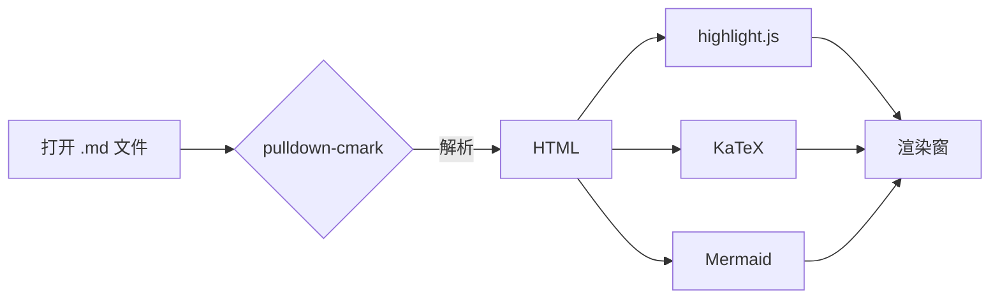
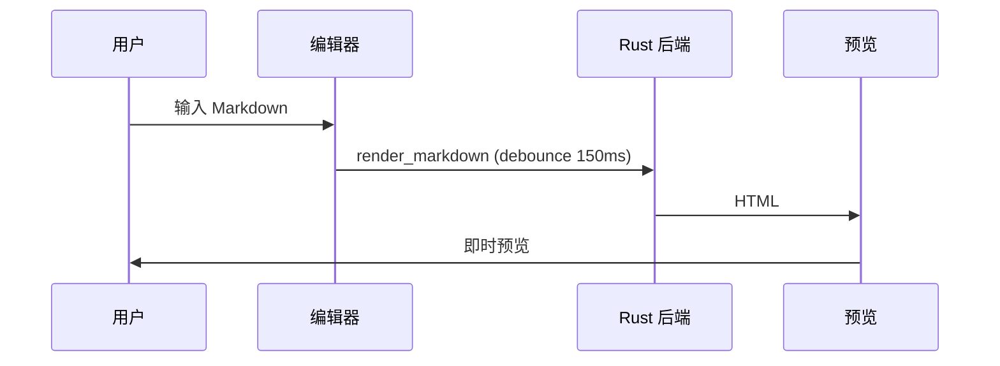

# md-v 功能测试文档

这是一份用于验证 md-v 渲染能力的测试文档，覆盖 GFM 扩展、代码高亮、数学公式和 Mermaid 图表。

## 1. 基础排版

**粗体**、*斜体*、~~删除线~~、`行内代码`，以及 [链接](https://gitee.com)。

> 引用块：多行引用
> 第二行引用

## 2. GFM 表格

| 特性 | 状态 | 说明 |
|:-----|:----:|-----:|
| 表格 | ✅ | 左中右对齐 |
| 任务列表 | ✅ | 见下方 |
| 代码高亮 | ✅ | highlight.js |
| 数学公式 | ✅ | KaTeX |
| Mermaid | ✅ | 懒加载 |

## 3. 任务列表

- [x] 项目脚手架
- [x] 核心渲染管线
- [ ] 发布 v1.0

## 4. 代码块

```rust
fn main() {
    let greeting = "Hello, md-v!";
    println!("{}", greeting);
}
```

```python
def fib(n):
    return n if n < 2 else fib(n - 1) + fib(n - 2)
```

```typescript
const add = (a: number, b: number): number => a + b;
```

## 5. 数学公式

行内公式：质能方程 $E = mc^2$，以及欧拉公式 $e^{i\pi} + 1 = 0$。

块级公式：

$$
\int_{-\infty}^{+\infty} e^{-x^2} \, dx = \sqrt{\pi}
$$

$$
\frac{\partial}{\partial t} \Psi = \frac{i\hbar}{2m} \nabla^2 \Psi
$$

## 6. Mermaid 图表





## 7. 脚注

Markdown 是一种轻量级标记语言[^1]。

[^1]: 由 John Gruber 于 2004 年创建。

## 8. 列表与嵌套

1. 有序项一
2. 有序项二
   - 无序子项
   - 又一个子项
     - 第三层

---

*文档结束。*
